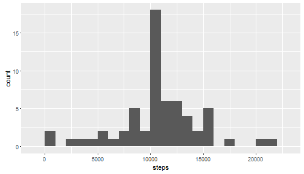

Reproducible Research: Peer Assessment 1
========================================

## Loading and preprocessing the data

```r
unzip('activity.zip')
data = read.csv('activity.csv')
data$dt = strptime(paste0(data$date, sprintf("%04d", data$interval)), "%Y-%m-%d %H%M")
data$interval1 = strptime(sprintf("%04d", data$interval), format="%H%M", tz="UTC")
data$date = as.Date(strptime(data$date, "%Y-%m-%d"))
```

## What is mean total number of steps taken per day?

```r
library('plyr')
stepsPerDay = ddply(data, .(date), summarize, steps=sum(steps, na.rm = T))

library('ggplot2')
g = ggplot(stepsPerDay, aes(x = steps)) + geom_histogram(aes(y = ..count..), binwidth = 1000)
print(g)
```


```r
mean(stepsPerDay$steps)
```

```
## [1] 9354.23
```

```r
median(stepsPerDay$steps)
```

```
## [1] 10395
```


## What is the average daily activity pattern?

```r
activityPerInterval1 = ddply(data, .(interval1), summarize, steps=mean(steps, na.rm = T))

g = ggplot(activityPerInterval1, aes(interval1, steps))
p = g + geom_line() + scale_x_datetime(date_labels = "%H:%M")
print(p)
```


```r
activityPerInterval1[activityPerInterval1$steps == max(activityPerInterval1$steps),]
```

```
##               interval1    steps
## 104 2016-03-07 08:35:00 206.1698
```


## Imputing missing values

Stratagy - NA changed by mean for that 5-minute interval.


```r
flNA = !complete.cases(data$steps)
sum(flNA)
```

```
## [1] 2304
```

```r
data1 = data
activityPerInterval = ddply(data, .(interval), summarize, steps=mean(steps, na.rm = T))
data1[flNA, ]$steps = sapply(data[flNA, ]$interval, function(x) +
                                 activityPerInterval[activityPerInterval$interval == x,]$steps)

stepsPerDay1 = ddply(data1, .(date), summarize, steps=sum(steps))
g = ggplot(stepsPerDay1, aes(x = steps)) + geom_histogram(aes(y = ..count..), binwidth = 1000)
print(g)
```



```r
mean(stepsPerDay1$steps)
```

```
## [1] 10766.19
```

```r
median(stepsPerDay1$steps)
```

```
## [1] 10766.19
```
Do mean and median total number of steps taken per day differ from the estimates from the first part of the assignment? 

- Yes, mean and median became greater.

What is the impact of imputing missing data on the estimates of the total daily number of steps?

- 8 Days with NA in initial dataset `data` bacame average days in new dataset `data1`.
  So density of days with near average number of steps growed. On hist central bar changed from 10 to 18.

## Are there differences in activity patterns between weekdays and weekends?

```r
#0 - Sun, 1 - Mon, 2 - Tue, 3 - Wed, 4 - Thu, 5 - Fri, 6 - Sat
#{0, 6} - weekend, {1,2,3,4,5} - weekday
data1$daytype = as.factor(c('weekend', 'weekday', 'weekday', 
                            'weekday', 'weekday', 'weekday', 'weekend')[data1$dt$wday + 1])

activityPerIntervalDaytype = ddply(data1, .(interval1, daytype), summarize, steps=mean(steps, na.rm = T))
activityPerIntervalDaytype$interval = as.factor(format(activityPerIntervalDaytype$interval1,
                                                       format = "%H:%M"))
library(lattice)

at <- seq(1, 289, 24)
labels <- activityPerIntervalDaytype[2 * at,]$interval
xyplot(steps ~ interval|daytype, data = activityPerIntervalDaytype, 
       type = "l", grid = TRUE, layout = c(1, 2), scales=list(x=list(at=at, labels=labels)))
```


